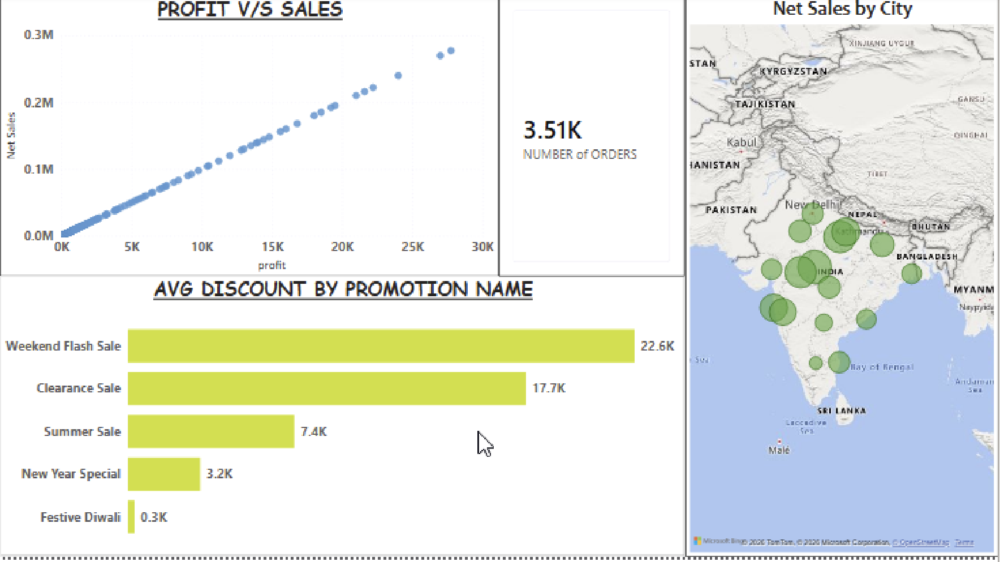
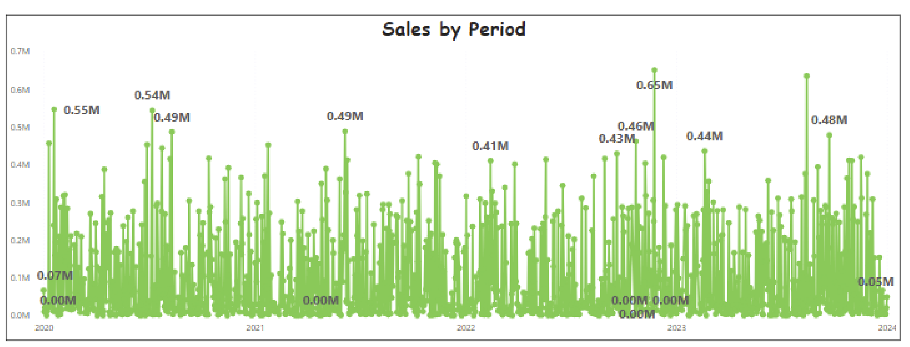
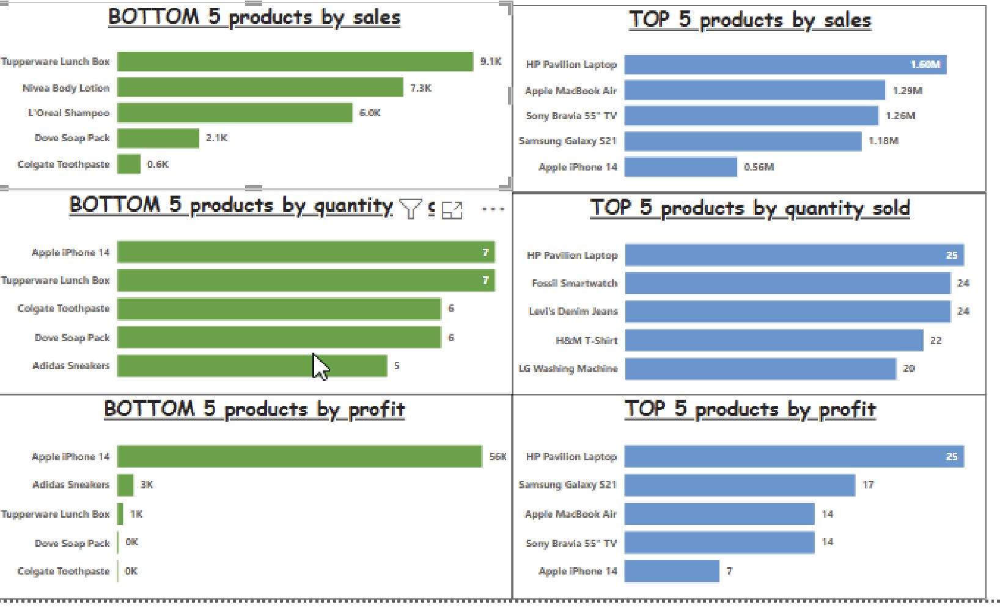
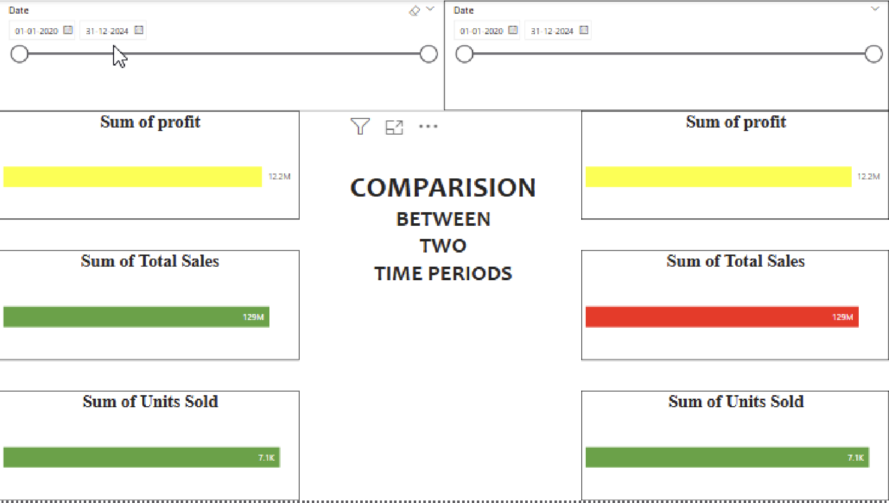

# Retail Performance Analytics Dashboard

## Overview
Comprehensive Power BI dashboard analyzing retail sales performance, resource allocation efficiency, and operational metrics across products, time periods, and geographic regions.

## Key Features

### Performance Analysis
- **Top/Bottom Performers**: Identifies best and worst performing products by sales, quantity, and profit
- **Deviation Tracking**: Highlights performance anomalies requiring management attention
- **Multi-dimensional Analysis**: 6 interactive pages covering different analytical perspectives

### Governance Insights
- **Resource Allocation**: Profit vs Sales correlation analysis for investment decisions
- **Geographic Distribution**: Regional performance monitoring with map visualization
- **Temporal Trends**: 5-year sales pattern analysis (2020-2024) for strategic planning
- **Discount Effectiveness**: Promotion performance analysis for budget optimization

### Analytical Capabilities
- **Comparative Analysis**: Side-by-side comparison of sales, profit, and units sold
- **Interactive Filtering**: Date range selection, customer segmentation, promotion filtering
- **Granular Details**: Transaction-level data table with 10+ dimensional attributes
- **KPI Monitoring**: Real-time tracking of key performance indicators

## Key Insights Demonstrated
- Sales peaked at 0.65M in specific periods with clear seasonal patterns
- Top performer (HP Pavilion Laptop) generated 1.66M in sales
- Bottom performers showing negative profitability requiring investigation
- Geographic concentration in specific regions indicating growth opportunities
- Discount effectiveness varies significantly by promotion type (Weekend Flash: 22.6K avg vs Festive Diwali: 0.3K)

## Technical Implementation
**Tools**: Power BI Desktop, Excel  
**Dataset**: Retail transaction data (2020-2024) with 3,511 orders  
**Data Points**: Customer details, product information, pricing, discounts, profits, geographic location  
**Visualizations**: 
- Scatter plots for correlation analysis
- Time-series trend lines
- Horizontal bar charts for rankings
- Geographic heat maps
- Comparison bar charts
- Interactive data tables

## Use Case for Governance
This dashboard serves as a performance monitoring tool for:
- Identifying products requiring strategic intervention (bottom performers)
- Validating resource allocation decisions through profit analysis
- Monitoring operational efficiency across regions
- Supporting data-driven discussions for leadership review
- Tracking performance deviations from expected patterns
- Evaluating promotional spending effectiveness

## Screenshots

### Overview Dashboard

### Sales Trends Analysis

### Top/Bottom Performance

### Comparative Analysis

## Data Source
Retail store transaction dataset (2020-2024) with customer, product, and sales information.
